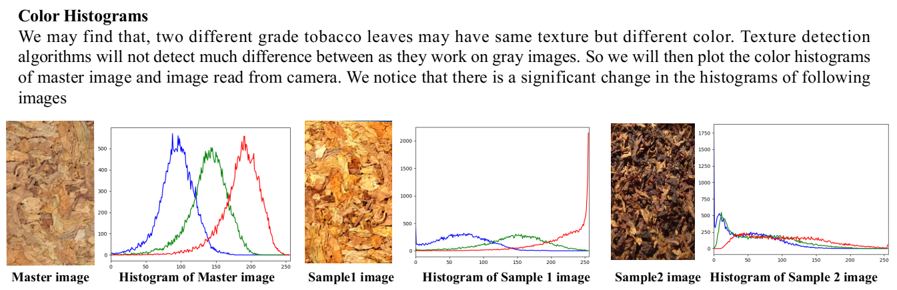
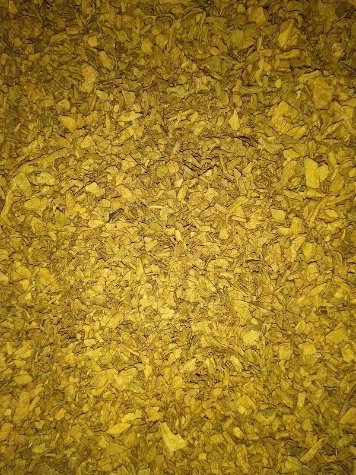
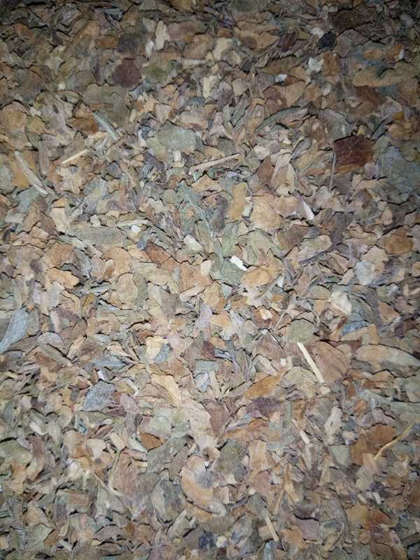
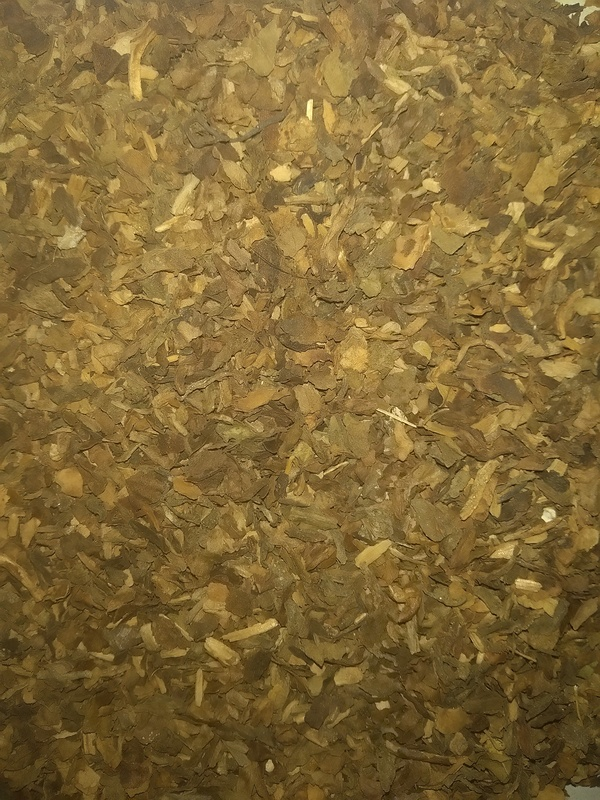
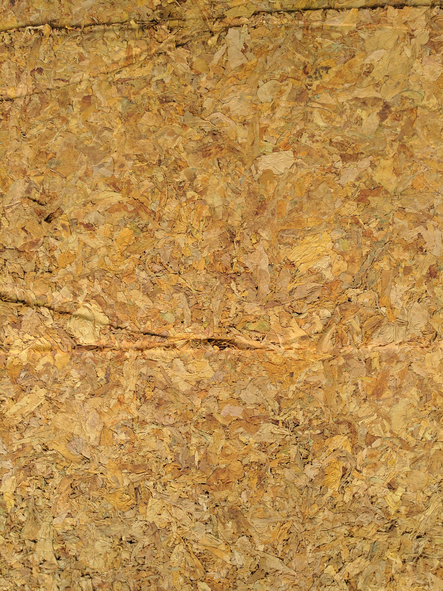
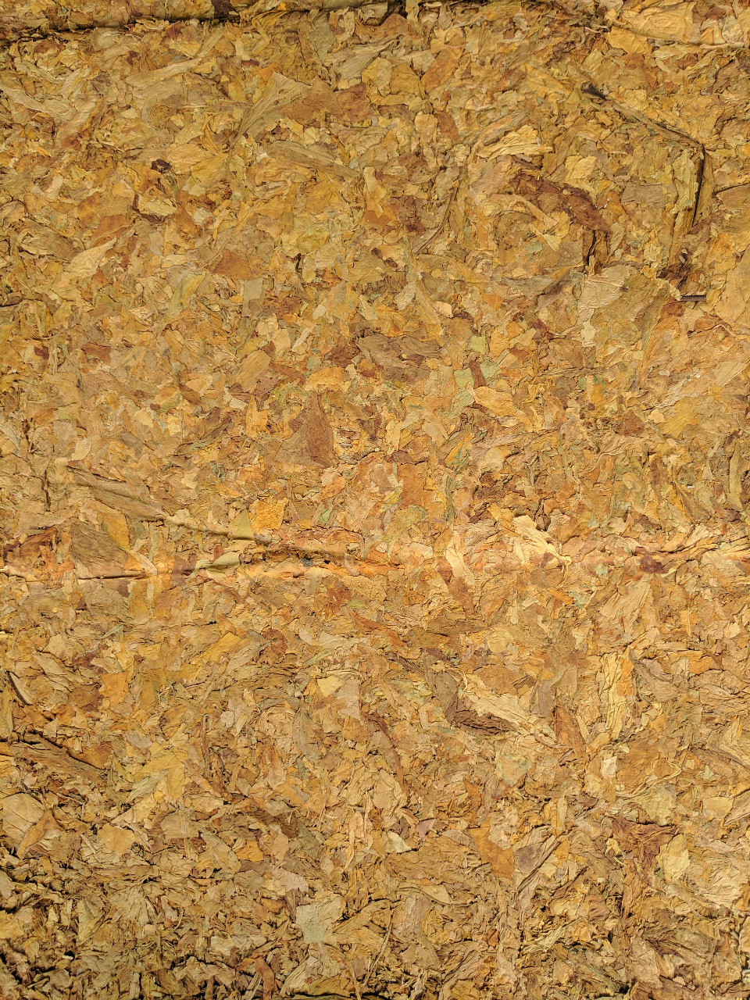
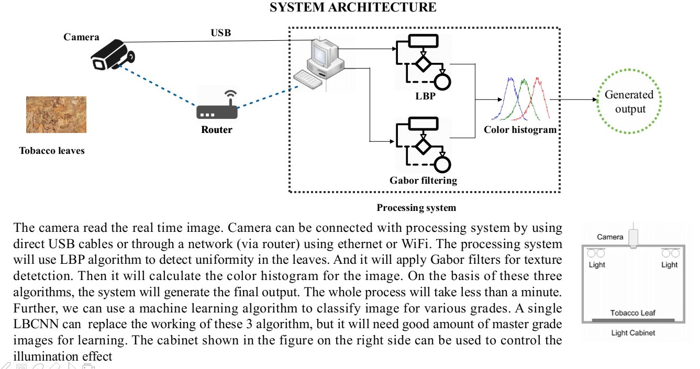

# ITC-Tobacoo
This repo contains code for the SIH 2019 project. Tobaco classification on the basis of color, texture and ripeness. This project was delivered to ITC ltd

## Features extracted
1) Gabor
2) LBP
3) Haralik
4) Color RGB
5) Color HSV
6) GLCM
7) Orb
8) And many more ...

 

## Old implementation dataset
 
 

## New implementation dataset
 
 

## System

